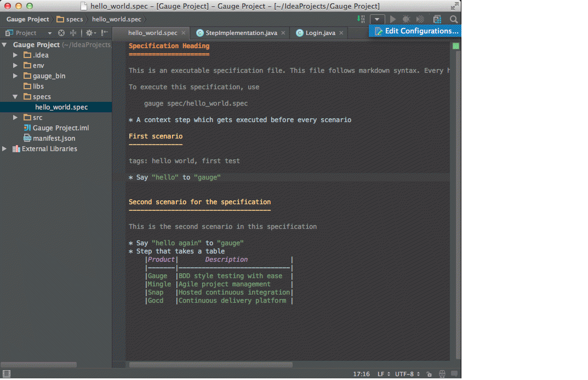

# Intellij Idea

Gauge projects can be created and executed from intellij. The plugin can be downloaded from the jetbrains plugin repository.

This plugin supports only [java](../test_code/java.md).


## Installation
* Follow the [Download and install instructions](http://www.jetbrains.com/idea/webhelp/installing-updating-and-uninstalling-repository-plugins.html#d645926e261) to get the gauge idea plugin from jetbrains plugin repository.
* The plugin can also be downloaded from the [gauge plugin home](http://plugins.jetbrains.com/plugin/7535) and installed manually,

##Features:

* Project Creation
* Syntax Highlighting
* Auto completion
* Navigation from step to implementation
* Quick Fix for unimplemented steps
* Execution
* Formatting

###1. Project Creation

 * File -> New Project.
 * Choose 'Gauge'
 * Choose the project location and java sdk
 * Finish

````
Note: If gauge-java is not installed, it will download it for the first time.
````


###2. Auto Completion
Steps present in the current project can be listed by invoking the auto completion pop up `ctrl+space` after the '*'. After choosing a step, it gets inserted with parameters highlighted, you can press `tab` to cycle between the parameters and edit them.


###3. Step Quick Fix

If you have an unimplemented step in the spec file, it will be annotated saying 'undefined step'. `alt+enter` can be pressed to open the quick fix pop up. The destination of the implementation can be chosen, either a new class or from a list of existing classes. It will then generate the step with required annotation and parameters.


###4. Formatting

A spec file can be formatted by pressing `ctrl+alt+shift l` (in windows and linux) and `cmd+alt+shift l`(in mac).

This formats all the elements of current spec including indentation of tables and steps.

###5. Execution

Specs can be executed by `right click -> Run spec`

####Debug

Debugging can be performed by attaching debugger to the gauge java process.

* Create a remote configuration `Gauge` which attaches to port `50005`
* Right click on spec -> Debug
* This will launch gauge in debug mode and waits for the debugger
* Now go to the run configuration and choose the remote configuration `Gauge` that was created
* This will start the execution and halts at breakpoints.



####Configuration

You can edit the run configuration to change the spec files or folders to be executed and the environment.


####Single Scenario Execution

A single scenario can be executed by doing a right click on the scenario which should be executed and choosing the scenario.
`right click -> run -> Scenario Name`

If the right click is done in context other than that of scenario, by default, first scenario will be executed.


