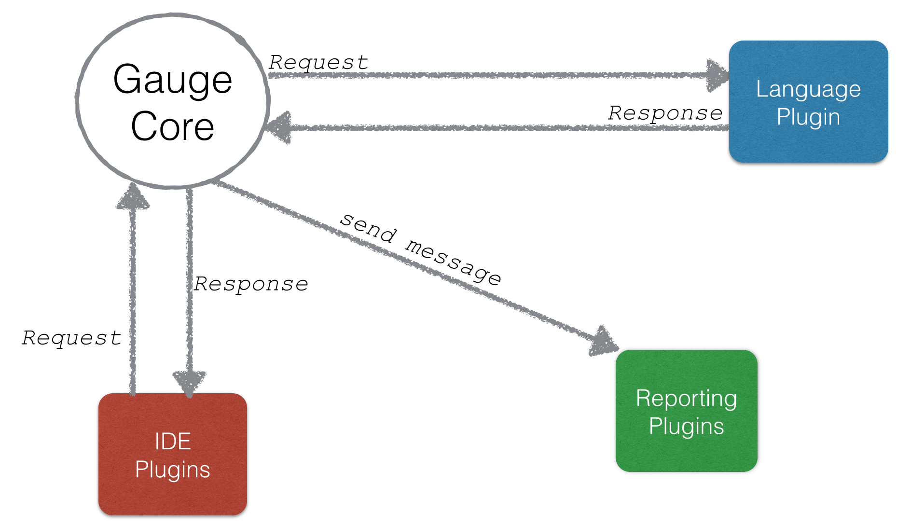

# API

There are different Request/Response for Language, Reporting and IDE Plugins.

The following sections details out Requests/Responses for different category of plugins.

- [Language Plugins](language_plugin_api.md)
- [Reporting Plugins](reporting_plugin.md)
- [IDE Plugins](ide_plugin.md)
