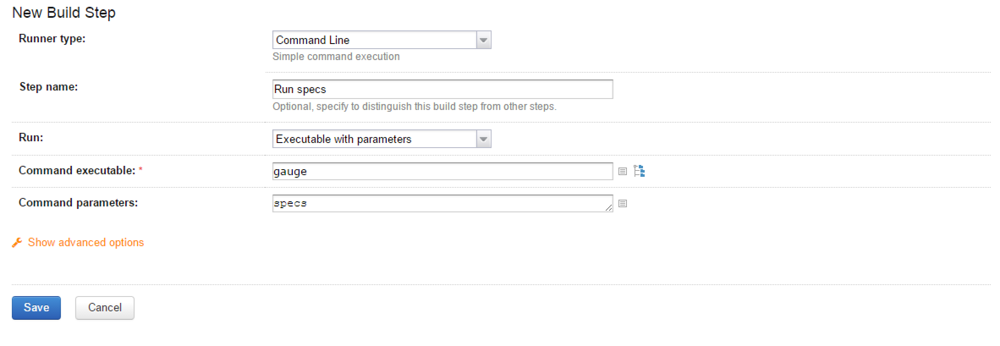

# TeamCity
[TeamCity](https://www.jetbrains.com/teamcity/) is a powerful and user-friendly Continuous Integration and Deployment server that works out of the box. 

## Integrating Gauge with TeamCity

* [Download](http://getgauge.io/get-started/index.html) and Install Gauge on the agents. Read more on installing Gauge [here](http://getgauge.io/documentation/user/current/installations/operating_system/).
* Install the required Gauge [language plugins](../../../installations/install_language_runners.md) on the agents as: `gauge --install <language>`

#### Tips on Installation

* Gauge is installed system wide by default and not user wide. However, plugins are installed per user. So plugins should be installed via user account with which the TeamCity agent executes. Refer default install location of Gauge and its plugins [here](http://getgauge.io/documentation/user/current/troubleshooting/installation.html).

* Alternately, you can set [custom location for plugins](http://getgauge.io/documentation/user/current/troubleshooting/installation.html#custom-plugin-install-location) so that its accessible to TeamCity agent running as a different user.

### Create execution task

* Create a new project in TeamCity pointing to Gauge project repository URL.
* Add a build step which will run `gauge specs`.
	

* If you want to run only a subset of specs, you can use [tags](../execution_types/tagged_execution.md). Eg. ```gauge --tags "tag1 & tag2" specs```
* Adding a flag `-p` runs them in [parallel](../execution_types/parallel_execution.md).
* Run against specific [environments](../managing_environments.md) using the ```--env``` flag
* See the [Gauge CLI](../../cli/README.md) for list of all flags that can be used.

### Reports

* Gauge generates **html-reports** after execution which can be configured in TeamCity by adding a new artifact in Artifacts tab. These artifacts can be viewed/downloaded from the artifacts tab.

    

* You can also add a [custom tab](https://confluence.jetbrains.com/display/TCD9/Including+Third-Party+Reports+in+the+Build+Results) to view your html reports generated.

	To add custom tab, go to Project Settings -> Report tabs -> Add a new build report tab. 

	

* **Console output** can be seen while execution of steps and reports can be seen after execution.
