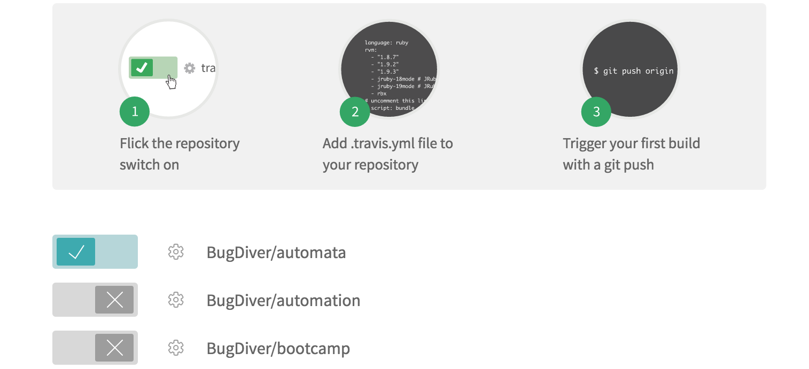
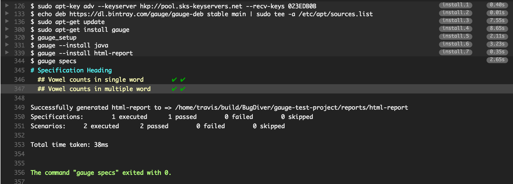

# Travis CI
[Travis CI](https://travis-ci.org/) is a hosted, distributed continuous integration service used to build and test software projects hosted at GitHub.


## Integrating Gauge with Travis CI
* Login to Travis CI and goto ```accounts``` menu.
* Choose your project repository to be built and flick that switch on.
    

## Creating tasks

* Create a ```.travis.yml``` file in your peoject root.
* Add these lines in ```.travis.yml``` according to the platform on which you want to build. 

language:
    - language_name

os:
    - osx

install:
    - brew install gauge
    - gauge --install <language>
    - gauge --install html-report

script: 'gauge specs'


sudo: false


language:
    - language_name

os:
    - linux

install:
    - sudo apt-key adv --keyserver hkp://pool.sks-keyservers.net --recv-keys 023EDB0B
    - echo deb https://dl.bintray.com/gauge/gauge-deb stable main | sudo tee -a /etc/apt/sources.list
    - sudo apt-get update
    - sudo apt-get install gauge
    - gauge_setup
    - gauge --install <language>
    - gauge --install html-report 

script: 'gauge specs'

sudo: true


* If you want to run only a subset of specs, you can use tags.
    Example: add ```script: gauge --tags "tag1 & tag2" specs``` in your ```.travis.yml```.
* Adding a flag ```-p``` runs them in [parallel](../execution_types/parallel_execution.md).
    Example: ```script: gauge -p specs``` in your ```.travis.yml```.
* Run against specific [environments](../managing_environments.md) using the ```--env``` flag.
* See the [Gauge CLI](../../cli/README.md) for list of all flags that can be used.

## Reports
* Goto your project on travis and see the console output.

    

* Gauge generates ```html-report``` after execution whose location can be set by environment variable ```gauge_reports_dir```. This defaults to ```reports``` directory in the Gauge project.

* You can upload Gauge execution reports to your choice of hosted web server. Read [more](https://docs.travis-ci.com/user/uploading-artifacts/) for uploading artifacts.