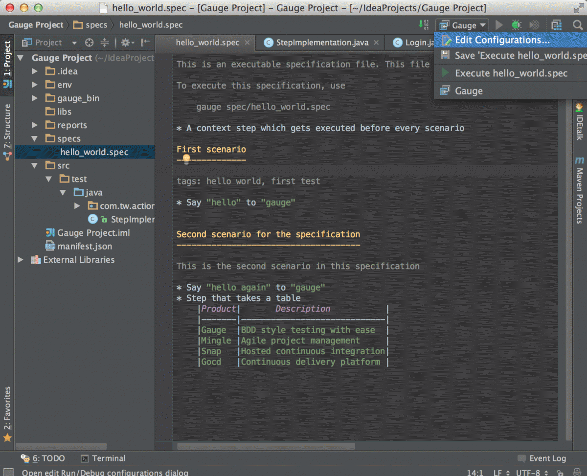

# Gauge IntelliJ plugin Features

* Project Creation
* Syntax Highlighting
* Auto completion
* Navigation from step to implementation
* Quick Fix for unimplemented steps
* Execution
* Formatting
* Rephrase steps
* Extract to concept

###1. Project Creation

 * File -> New Project.
 * Choose 'Gauge'
 * Choose the project location and java sdk
 * Finish

````
Note: If gauge-java is not installed, it will download it for the first time.
````


###2. Auto Completion
Steps present in the current project can be listed by invoking the auto completion pop up `ctrl+space` after the '*'. After choosing a step, it gets inserted with parameters highlighted, you can press `tab` to cycle between the parameters and edit them.


###3. Step Quick Fix

If you have an unimplemented step in the spec file, it will be annotated saying 'undefined step'. `alt+enter` can be pressed to open the quick fix pop up. The destination of the implementation can be chosen, either a new class or from a list of existing classes. It will then generate the step with required annotation and parameters.


###4. Formatting

A spec file can be formatted by pressing `ctrl+alt+shift l` (in windows and linux) and `cmd+alt+shift l`(in mac).

This formats all the elements of current spec including indentation of tables and steps.

###5. Execution

* Specs can be executed by `right click -> Run spec`.
* Execute all specs inside a directory by `right click -> Run specifications`

####5.1. Single Scenario Execution

A single scenario can be executed by doing a right click on the scenario which should be executed and choosing the scenario.
`right click -> run -> Scenario Name`

````
Note: If the right click is done in context other than that of scenario, by default, first scenario will be executed.
````


####5.2. Parallel Execution
To run multiple specifications in parallel
* Right click on the ```specs``` directory and select ```Create Specifications``` option.
* In the new Run configuration select ```In Parallel``` options. This will distribute specs execution based on number of cores the machine has.
* You can also specify the ```Number of parallel execution streams```. This is optional
````
Caution: Select parallel nodes based on current systems performance.
For example on a 2 core machine select upto 4 parallel streams.
A very large number may affect performance.
````
* Select ```ok```. Now you can run this new configuration for parallel execution of specs.


####5.3. Debugging

Debugging can be performed by attaching debugger to the gauge java process.

* Create a new  ```Remote``` configuration named `Gauge` and set the port number to `50005`. Do this by selecting **Edit configurations** and pressing the plus icon.
* Right click on spec/specs -> Debug
* Now go to the run configuration and execute the remote configuration `Gauge` that was created.
* This will start the execution and halts at breakpoints.

````
Note: The remote configuration (Gauge) needs to be run after launching the spec in debug mode.
Run the debug config for the second time if it does not connect for the first time.
```


###6. Run Configuration

You can edit the run configuration to make changes to:
* The scenario or spec file to be executed
* The environment to run against
* Add a tag filter to the execution
* Choose the number of parallel streams




###7. Rephrase Steps
* Press **Shift+F6** on a step to rephrase it.
* The parameters will be in ```< >``` in the rephrase dialog. They can be reordered,removed or new parameters can be added.
* The rephrase change will reflect across **all the specs** in the project.


