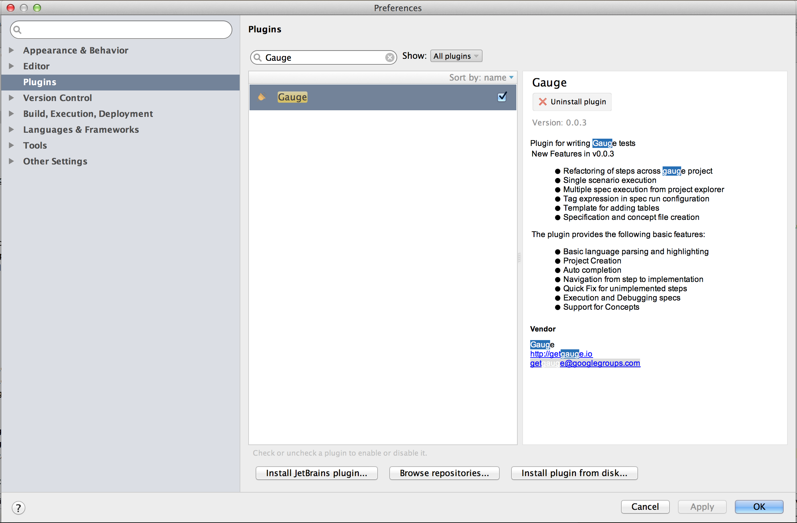

# Intellij IDEA

Gauge projects can be created and executed from Intellij IDEA. The plugin can be downloaded from the JetBrains plugin repository.

This plugin supports only [java](../test_code/java/java.md).


## Installation

Plugin can be installed by downloading from Jetbrains plugin repository.

Steps to install Gauge Intellij IDEA plugin from IDE:

* Open the Settings dialog (e.g. ⌘ Comma).
* In the left-hand pane, select Plugins.
* On the Plugins page that opens in the right-hand part of the dialog, click the Install JetBrains plugin or the Browse repositories button.
* In the dialog that opens, search for Gauge. Right-click on **Gauge** and select Download and Install.

    
* Confirm your intention to download and install the selected plugin.
* Click Close.
* Click OK in the Settings dialog and restart IntelliJ IDEA for the changes to take effect.

````
Note: The plugin you have installed is automatically enabled. When necessary, you can disable it as described in Enabling and Disabling Plugins.
```

To install plugin by downloading it manually or to update plugin, follow the steps [here](https://www.jetbrains.com/idea/help/installing-updating-and-uninstalling-repository-plugins.html#d645926e261).

Create a new Gauge project and start writing your tests.

Explore all the [features of Gauge Intellij IDEA plugin](features.md) now!
