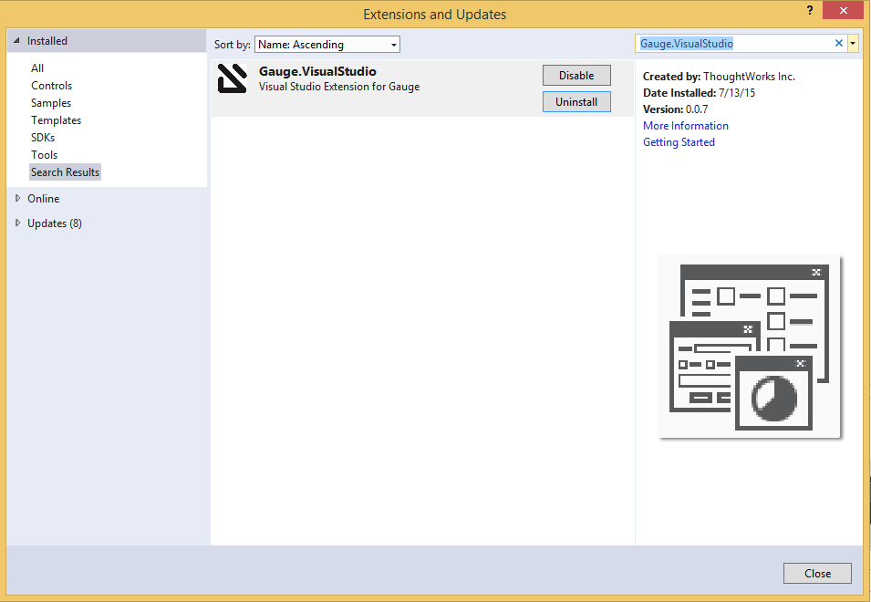

# Visual Studio

Gauge projects can be created and executed in Visual Studio using the Visual Studio plugin for Gauge. This plugin can be installed from Visual Studio Gallery.

##Installation

Open Visual Studio Extension Manager - `Tools` -> `Extensions and Updates`. Search for `Gauge.VisualStudio`.

The extension resides [here](https://visualstudiogallery.msdn.microsoft.com/d34964c5-3bf8-4138-be63-01214cb1db3e) on the Visual Studio Gallery.

