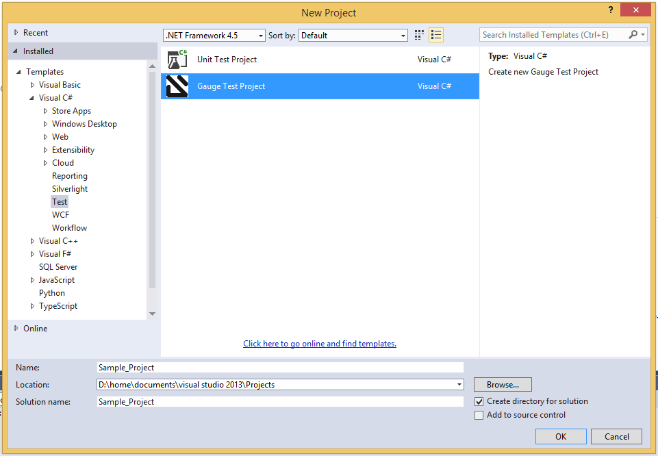

# Features

* [Project Creation](#project-creation)
* [Syntax Highlighting](#syntax-highlighting)
* [Auto Completing](#auto-completing)
* [Navigation](#navigation)
* [Smart Tag](#smart-tag)
* [Test Runner](#test-runner)
* [Create Spec and Concept files](#create-spec-and-concept-files)


## Project Creation

- Go to `File` -> `New Project`.
- Choose `Gauge Test Project` under Visual C# Test category.



- Choose the Project location and Project Name.
- Click `OK`.

This should setup a new Gauge project, and add the required meta data for Gauge to execute this project.

Alternately, you can create a Gauge project from command-line as:

```
$ mkdir <project_name>
$ cd <project_name>
$ gauge --init csharp
```

This creates `<project_name>.sln` file which can be opened with Visual Studio.

[top](#)
## Syntax Highlighting

Gauge specs are in [Markdown](http://daringfireball.net/projects/markdown/syntax) syntax. This plugin highlights Specifications, Scenarios, Steps and Tags.

Steps with missing implementation are also highlighted.


## Auto Completing

This plugin hooks into VisualStudio Intellisense, and brings in autocompletion of Step text. The step texts brought in is a union of steps already defined, concepts defined, and step text from implementation.

*Hint:* Hit <kbd>Ctrl</kbd> + <kbd>Space</kbd> to bring up the Intellisense menu.


## Navigation

Jump from Step text to it's implementation.

Usage: `Right Click` -> `Go to Declaration` or hit <kbd>F12</kbd>

## Smart Tag

Implement an unimplemented step - generates a method template, with a `Step` attribute having this Step Text.


## Test Runner

Open the Test Explorer : `Menu` -> `Test` -> `Windows` -> `Test Explorer`
All the scenarios in the project should be listed. Run one or more of these tests.


## Create Spec and Concept files

* You can right-click on `specs` directory or any nested directory, choose `Add` -> `New Item` -> Go to `Gauge` under `Visual C# Items`.
* Choose `Specification` or `Concept` file type.
* Enter file name and click `Add`.


