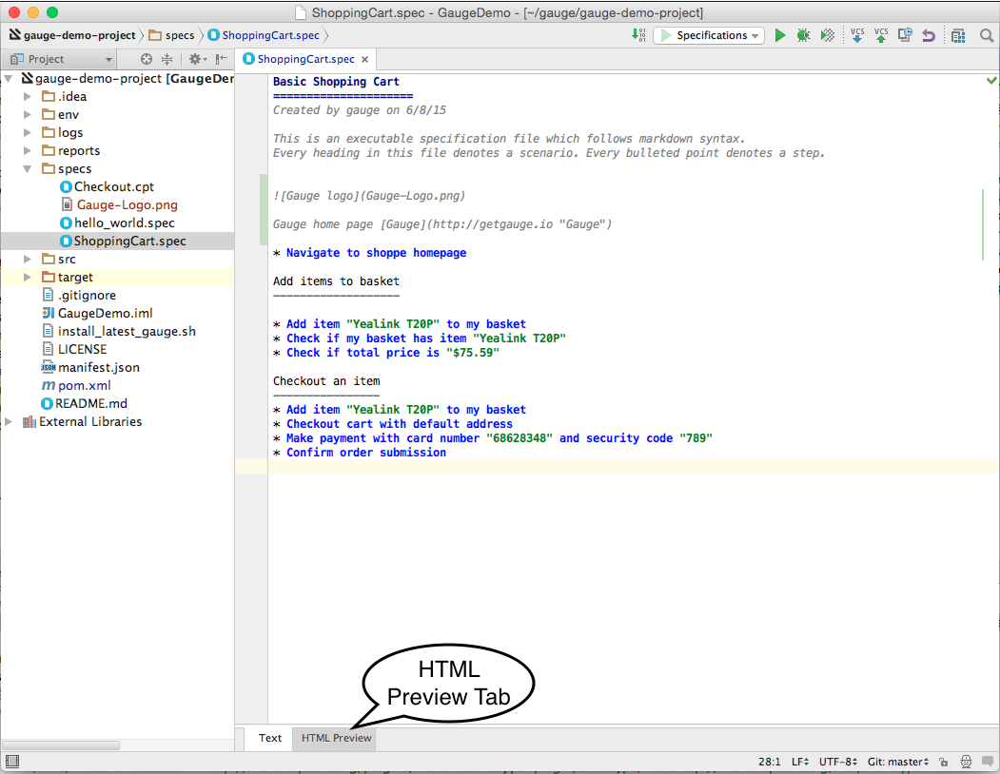

# Additional Usability features

The intellij idea gauge plugin comes with more features to simplify writing specifications.

## Create Spec and Concept files
* You can right-click in under any directory in the specs directory and create a new [specification](../specifications/README.md) or [concept](../specifications/concepts.md) file. They will be created with a template to get you started.

## Creating markdown table
* To easily create markdown tables in specification(.spec) or concept(.cpt) files you can use predefined table templates specifying the number of columns needed.

For example, to create a table with 4 columns type

Then fill the column names in the template.

## Writing Specification Heading

* To write the specification heading in markdown, you can use the predefined heading template.

Then fill the specification name in the template.

## Writing Scenario Heading
* Scenario heading in markdown can be easily written using the predefined scenario heading template.

Then fill the scenario name in the template.

## Format Specification
* A specification file can be formatted easily using the keyboard shortcut `ctrl+alt+shift+l` (in windows and linux) and `cmd+alt+shift+l`(in Mac).

This formats the specification including indentation of tables and steps.

## HTML Preview Tab

* A specification file, written in markdown can be viewed as an HTML preview.

This is a spec file in markdown.

On click of the `HTML Preview` tab at the bottom of the editor, it shows the HTML equivalent preview of spec file.

Since specs are written in markdown, they can be converted to HTML using any markdown to HTML convertors.
